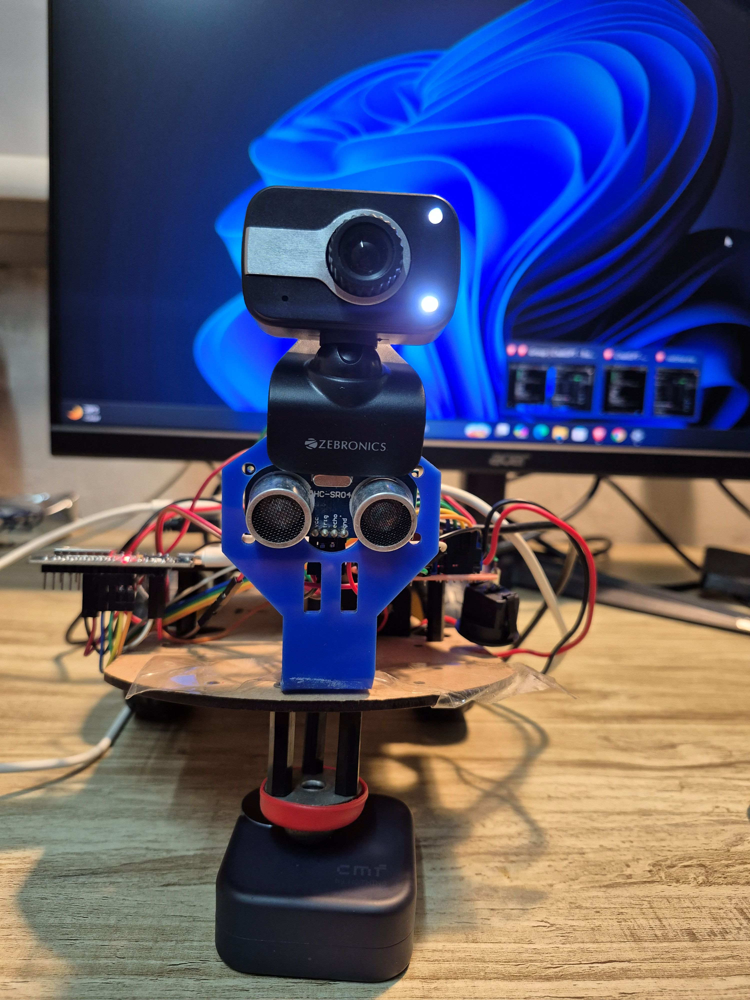
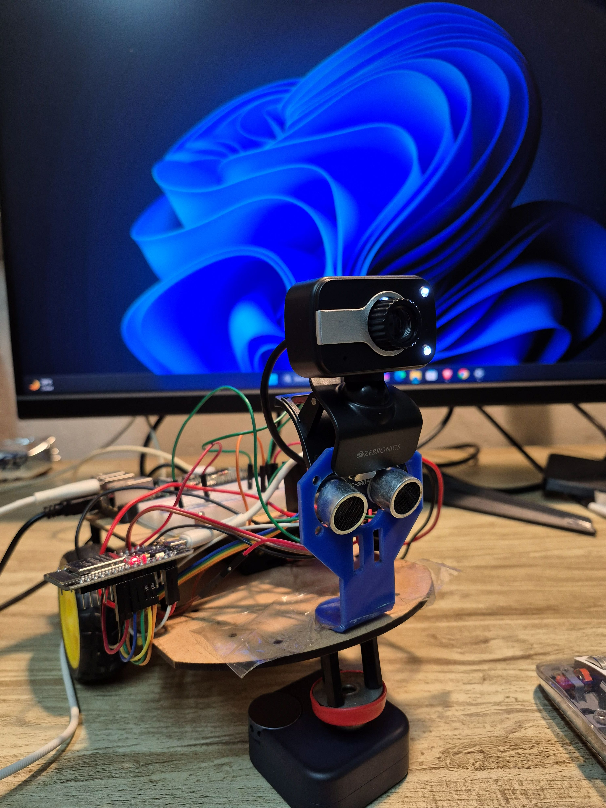
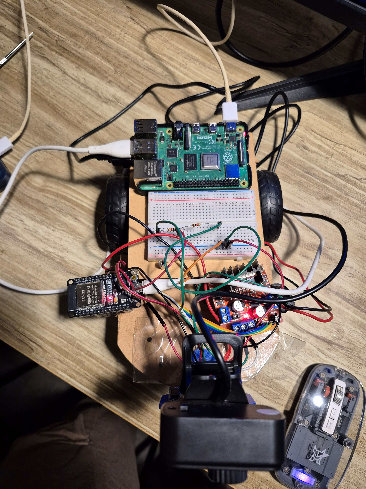

# 🤖 Embodied AI Rover

<p align="center">
  
</p>

<p align="center">
  <b>A low-cost embodied AI rover combining robotics, computer vision, embedded systems, and AI.</b>
</p>

---

## 🚀 Overview

The **Embodied AI Rover** is a low-cost mobile robotics platform designed to explore how AI can interact with and control a physical environment.

The system combines:

- 🤖 Differential-drive mobile robot
- 🧠 Raspberry Pi for high-level computing
- ⚡ ESP32 for low-level motor and sensor control
- 👁️ USB camera for visual perception
- 🎯 YOLO for real-time object detection
- 📡 Ultrasonic sensing for distance measurement
- 🌐 Flask-based web dashboard for remote control and monitoring

The long-term goal is to evolve the rover from a remotely controlled robot into an **autonomous embodied AI agent** capable of perceiving its environment, making decisions, and interacting with the physical world.

---

## 📸 The Rover

<p align="center">
  
  
</p>

<p align="center">
  
</p>

---

## 🧠 System Architecture

```text
                 ┌──────────────────┐
                 │    USB Camera    │
                 └────────┬─────────┘
                          │
                          ▼
                 ┌──────────────────┐
                 │ OpenCV + YOLO    │
                 │ Visual Perception│
                 └────────┬─────────┘
                          │
                          ▼
                 ┌──────────────────┐
                 │  Raspberry Pi    │
                 │ AI / Control     │
                 └────────┬─────────┘
                          │
                    USB Serial
                          │
                          ▼
                 ┌──────────────────┐
                 │      ESP32       │
                 │ Motor + Sensors  │
                 └───────┬──────────┘
                         │
                         ▼
                 ┌──────────────────┐
                 │   L298N Driver   │
                 └────────┬─────────┘
                          │
                          ▼
                    DC Gear Motors


       HC-SR04 Ultrasonic Sensor
                  │
                  ▼
                ESP32
                  │
                  ▼
             Serial Data
                  │
                  ▼
             Raspberry Pi

| Feature                            | Status            |
| ---------------------------------- | ----------------- |
| Differential-drive movement        | ✅ Working         |
| Forward / Backward                 | ✅ Working         |
| Left / Right turning               | ✅ Working         |
| Stop command                       | ✅ Working         |
| ESP32 motor control                | ✅ Working         |
| Raspberry Pi ↔ ESP32 communication | ✅ Working         |
| Ultrasonic distance sensing        | ✅ Working         |
| USB camera                         | ✅ Working         |
| OpenCV camera processing           | ✅ Working         |
| YOLO object detection              | ✅ Working         |
| Flask web dashboard                | ✅ Working         |
| Object-following foundation        | 🟡 In Development |
| Autonomous navigation              | 🔵 Planned        |
| Voice commands                     | 🔵 Planned        |
| Agentic task planning              | 🔵 Planned        |

👁️ Computer Vision

The rover uses a USB camera connected to the Raspberry Pi for visual perception.

YOLO is used to detect objects in the camera stream.

Example: Object Detection
<p align="center">  </p>
Example: Hand Detection
<p align="center">  </p>

The detected objects can later be used as inputs for robot decision-making and closed-loop control.

| Component              | Purpose                     |
| ---------------------- | --------------------------- |
| Raspberry Pi 4 Model B | High-level computing        |
| ESP32 DevKit           | Motor and sensor controller |
| L298N                  | Motor driver                |
| DC geared motors       | Rover movement              |
| Rover chassis          | Mobile platform             |
| HC-SR04                | Distance measurement        |
| USB Webcam             | Visual perception           |
| Power supply           | Robot power                 |
| OLED / sensors         | Experimental extensions     |

💻 Software Stack
Python
OpenCV
YOLO / Ultralytics
Flask
PySerial
Arduino / ESP32
Linux / Raspberry Pi OS
🌐 Rover Dashboard

A Flask-based dashboard provides remote control and monitoring.

The dashboard can:

Control rover movement
Display camera feed
Display detected objects
Display sensor information
Provide a foundation for autonomous control

📁 Project Structure

embodied-ai-rover/
│
├── computer_vision/
│   ├── camera_test.py
│   ├── yolo_detect.py
│   └── object_follow_logic.py
│
├── esp32/
│   └── esp32_rover.ino
│
├── raspberry_pi/
│   ├── test_esp32.py
│   ├── control_test.py
│   └── dashboard/
│       ├── app.py
│       └── templates/
│           └── index.html
│
├── docs/
│   ├── images/
│   │   ├── rover-front.jpg
│   │   ├── rover-side.jpg
│   │   ├── rover-hardware.jpg
│   │   ├── yolo-bottle.png
│   │   └── yolo-hand.png
│   └── project_status.md
│
├── requirements.txt
├── LICENSE
└── README.md
🔬 Engineering Focus

This project explores the integration of several areas of robotics and AI:

Embedded Systems → ESP32, sensors, motor control

Robotics → differential drive and mobile robot control

Computer Vision → OpenCV and YOLO

AI → object perception and decision-making

Networking → Raspberry Pi ↔ ESP32 communication

Human-Robot Interaction → web-based control interface

🧪 Current Development Stage

Prototype / Active Development

The current version demonstrates the integration of the robot's hardware, communication, sensing, visual perception, and remote control systems.

The next stage is to move from individual working components toward a closed-loop autonomous system.

🗺️ Roadmap
Phase 1 — Robotic Platform
 Build rover chassis
 Motor control
 ESP32 integration
 Raspberry Pi integration
 Sensor integration
Phase 2 — Visual Perception
 USB camera
 OpenCV
 YOLO object detection
 Dashboard visualization
Phase 3 — Autonomous Behavior
 Closed-loop object following
 Obstacle avoidance
 Target tracking
 Autonomous navigation
Phase 4 — Embodied AI Agent
 Voice commands
 Natural-language task interpretation
 Agentic task planning
 Memory / context
 Multi-step physical actions
Phase 5 — Advanced Robotics
 Robotic arm
 Object manipulation
 SLAM / mapping
 More advanced navigation
 Real-world task execution
🎯 Vision

The ultimate goal is to transform this prototype into an embodied AI agent that can:

Perceive → Understand → Plan → Act → Observe → Adapt

Instead of simply following predefined commands, the rover should eventually be capable of understanding high-level instructions and performing physical tasks autonomously.

👨‍💻 Author

Vaibhav

B.Tech Computer Science & Engineering — AI & ML

Interested in:

🤖 Robotics
🧠 Artificial Intelligence
👁️ Computer Vision
🔌 Embedded Systems
🚀 Autonomous Systems
🌏 Robotics Research

📜 License

This project is licensed under the MIT License.

### Step 5B — Commit it

After pasting:

1. Scroll to the bottom.
2. Click **`Commit changes...`**
3. Keep the default message.
4. Click **`Commit changes`**.

Then open your repository's main page and look at the README.

**Don't do anything else yet.** Tell me **“done”** once you've committed it.
